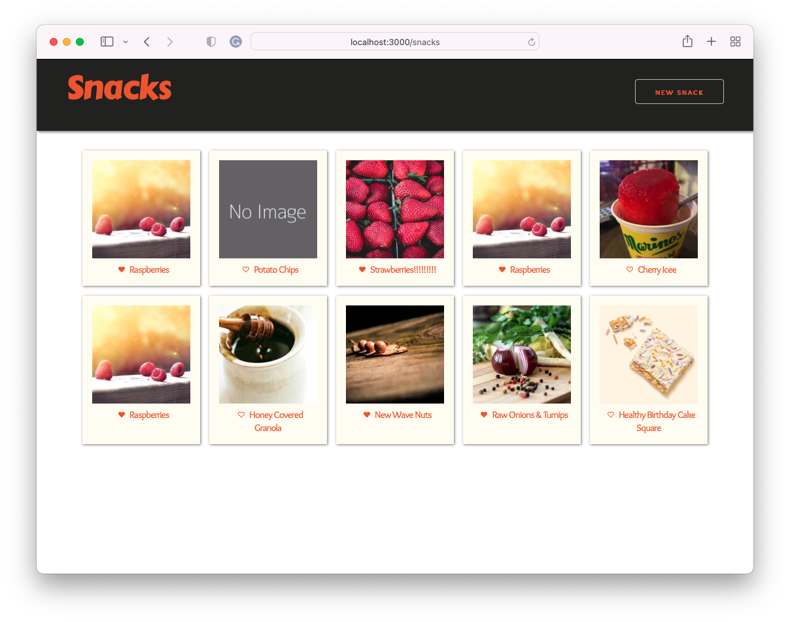
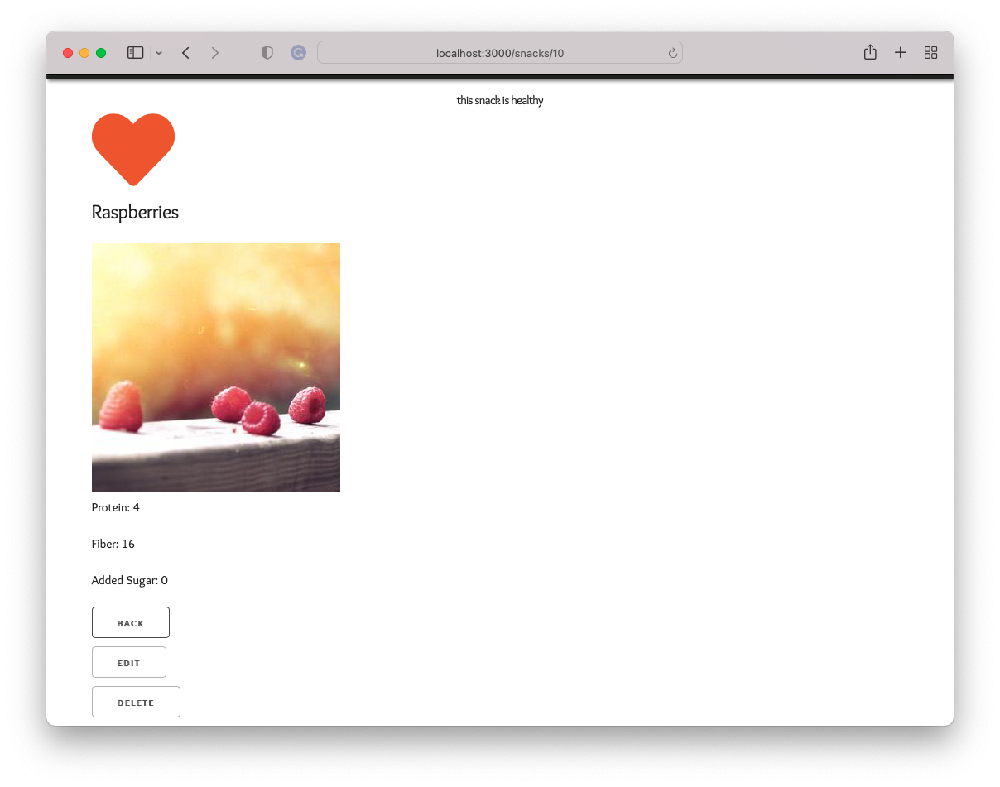
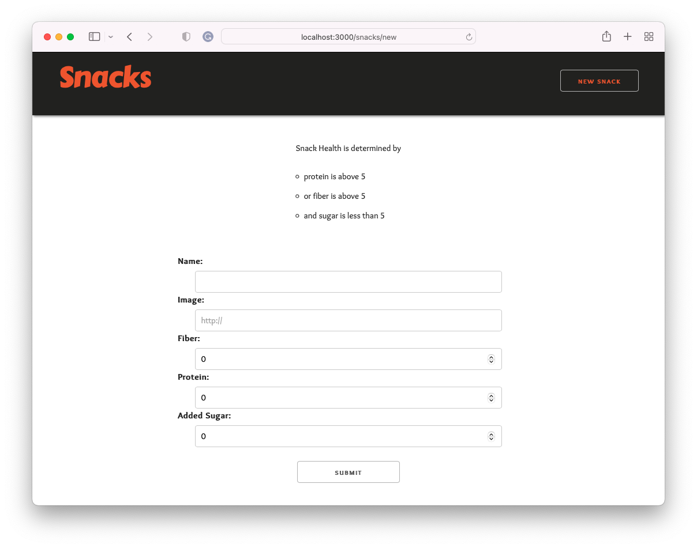
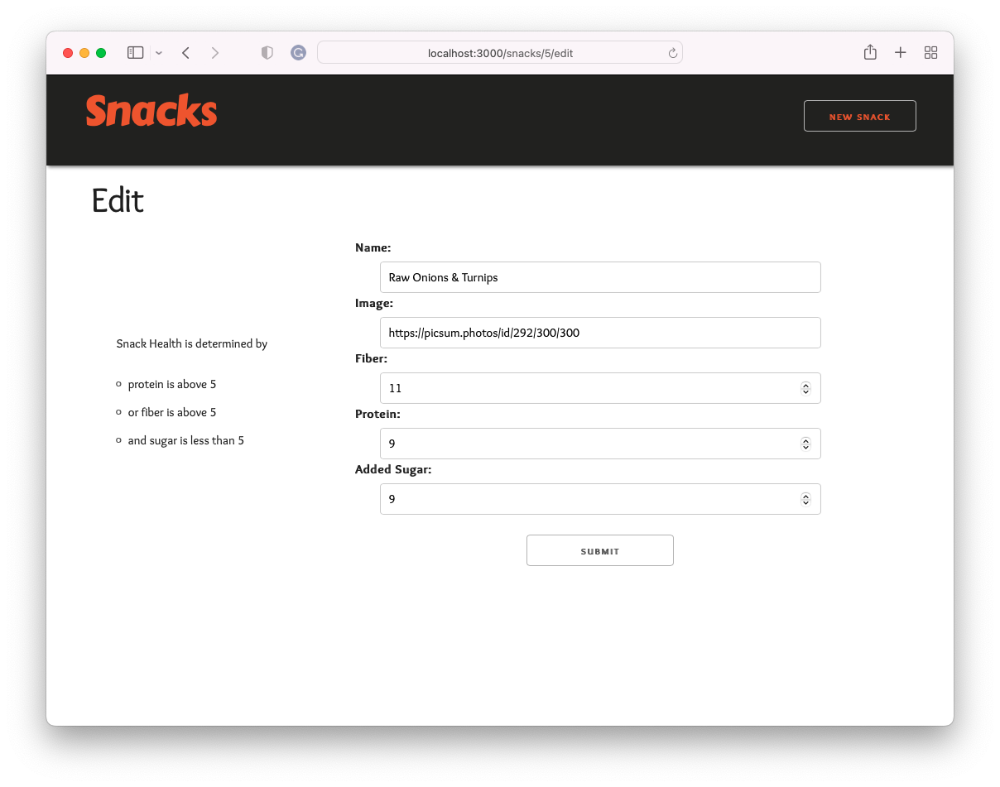

# Full Stack Application Pair Project

## Snack-a-log

Create an app that allows users to log their favorite snacks. Add functionality that will enable users to see whether or not their snack is healthy based on a simple algorithm.

For this project, there are 40 features or functionality to build. You are required to successfully build a minimum of 28 features to pass this project.

## Overview

### Basic Instructions
- Using the [`project-snack-a-log-frontend`](https://github.com/9-1-pursuit/project-snack-a-log-frontend) and [`project-snack-a-log-backend`](https://github.com/9-1-pursuit/project-snack-a-log-backend) repos, create a full-stack web application by building the two applications and having them interact.
- Use Express to build a complete CRUD back-end application that adheres to RESTful routes.
- Deploy the applications separately so that anyone can see them online and the two online applications can interact.


### Groups
- You will be working in groups of 4 for this 4 day Sprint.
- One person should create a Trello board and add all members to it
- One person in the group should fork and clone the front end
- One person in the group should fork and clone the backend
- All group members should be added as collaborators to the repos


### Question Asking
- You will be given 4 tokens. These tokens represent the number of debugging questions **per team** you are allowed to ask an instructor during this complete sprint. (clarifying questions about the instructions are not included)

## User Stories, Acceptance Criteria, and Code Quality Rubric

### Back-end setup

It would be best if you began with the back-end setup and then moved on to setting up the front-end.

### Front-end

1. Index page
1. It Can load the index page and has navigation to the New page
1. Has a list of snack cards that are coming from the back-end seed data
1. Has a link to each snack's show page
1. Has a solid heart, if the snack is healthy
1. Has a heart outline; if the snack is unhealthy
1. Has the CSS that is detailed in the tests
1. Show page
1. Shows header text
1. Can navigate to the New page
1. Snack has correct information displayed
1. Contains action/navigation buttons
1. New page
1. Shows the header text
1. Has a form with the correct labels and fields
1. Can create a snack and then redirects back to the index page
1. Edit page
1. Has a form with the correct labels and fields
1. Data is pre-filled into the form
1. Can update a snack and then redirects back to the index page
1. Delete button
1. Can delete a snack using the app
1. Front-end hosted and accessible online

> **Total**: 23 points

> **Note**: There are no front-end tests; your hosted application's functionality and code quality will be used to evaluate you.

### Additional points:

- Completed front-end (see [project-snack-a-log-back-end](https://github.com/9-1-pursuit/project-snack-a-log-backend) for more details)

> **Grand total**: 45 points

## Getting Started

1. Navigate to your directory called `project-snack-a-log`.
1. `cd` into the directory.
1. Fork and clone the [`project-snack-a-log-front-end`](https://github.com/9-1-pursuit/project-snack-a-log-frontend) repo into your `project-snack-a-log` directory.
1. Change the name of your `project-snack-a-log-front-end` directory to `front-end`.

> **Note**: Your `back-end` directory should be adjacent to your `front-end` directory. Both should be their own git repositories. The top-level `project-snack-a-log` folder should **NOT** be a git repository.

### Front-end setup

It would be best if you opened a new terminal tab dedicated to running and developing your front-end.

- `cd front-end`
- `touch .env`

**.env**

```
REACT_APP_API_URL=http://localhost:3333
```

- `npm install` - install npm packages listed in `package.json`.
- `npm start` - make sure your React app can start

## Screenshots

These lightly styled views are to help clarify the project requirements. It would be best if you spent some time styling your app, but you are not required to mimic the style shown below.

### Index page



### Show page



### New page



### Edit page



## Resources

Use the resources below to deploy your application.

### Front-end Deployment

1. [Netlify Deployment Instructions](https://github.com/9-1-pursuit/guide-deployment/tree/main/netlify-create-react-app)
1. [Netlify Deployment Video](https://drive.google.com/file/d/1am3ljqxJTyvPQ5hzlsaU7o_bf6-lA4UK/view?usp=sharing)
1. [Snack-A-Log Video-Demo](https://drive.google.com/file/d/1aVnfu7ANdUPbfJhtSb45G2r0JSGtSI2t/view?usp=sharing)